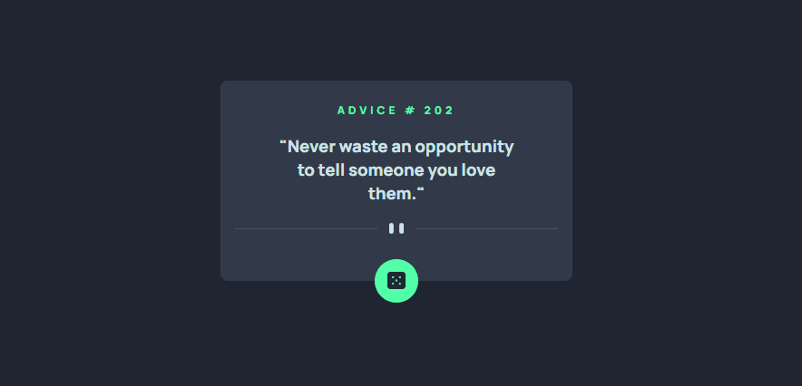

# Frontend Mentor - Solução para app gerador de conselhos

Esta é uma solução para [Advice generator app challenge on Frontend Mentor](https://www.frontendmentor.io/challenges/advice-generator-app-QdUG-13db). Os desafios do Frontend Mentor ajudam você a melhorar suas habilidades de programação construindo projetos realistas.

## Índice

- [Visão geral](#visão-geral)
  - [O desafio](#o-desafio)
  - [Captura de tela](#captura-de-tela)
  - [Links](#links)
- [Meu processo](#meu-processo)
  - [Construído com](#construído-com)   
  - [Recursos úteis](#recursos-úteis)
- [Autor](#autor)
- [Agradecimentos](#agradecimentos)

## Visão geral

### O desafio

Os usuários devem ser capazes de:

- Ver o layout ideal para o aplicativo, dependendo do tamanho da tela do dispositivo
- Ver os hover states para todos os elementos interativos na página
- Gerar um novo conselho clicando no ícone do dado

### Captura de tela

### Links

- URL da solução: [Github](https://github.com/BraynnerM/app-gerador-de-conselhos)
-  URL do site no Github Pages: [App gerador de conselhos](https://braynnerm.github.io/app-gerador-de-conselhos/)

## Meu processo

### Construído com

- Marcação semântica HTML5 
- Propriedades personalizadas do CSS
- Flexbox
- Javascript
- API

### Recursos úteis

- [Perfect pixel](https://www.welldonecode.com/perfectpixel/) - Me ajudou muito a conseguir fazer o meu projeto a ficar o mais parecido possível com o modelo do Frontend mentor.
- [Responsive viewer](https://responsiveviewer.org/) - Me ajudou a visualizar a responsividade do projeto para diferentes tamanhos de tela.
- [ScreenToGif](https://www.screentogif.com/) - Tornou possível a criação de um gif onde eu demonstro o projeto em execução.

## Autor

- Linkedin - [BraynnerM](https://www.linkedin.com/in/braynner-marques-ribeiro-de-oliveira-88142b256/)
- Github - [BraynnerM](https://github.com/BraynnerM)
- Frontend Mentor - [BraynnerM](https://www.frontendmentor.io/profile/BraynnerM)
- Twitter - [BraynnerMarques](https://twitter.com/BraynnerMarques)
- E-mail - [braynnermarques@hotmail.com](mailto:braynnermarques@hotmail.com)

## Agradecimentos

Agradeço aos [Gêmeos - Dev em dobro](https://www.instagram.com/devemdobro/) que contribuiram muito com ensinamentos para que a resolução deste projeto fosse possível.